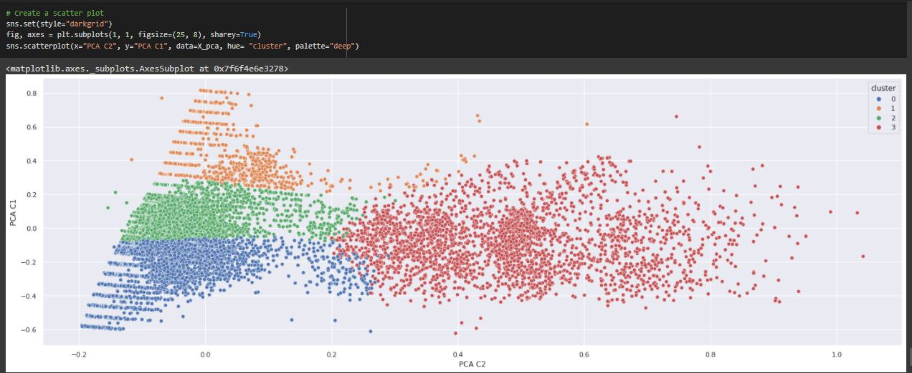

# E-Commerce-Retail-Data-Analysis

 

## Business Objectives :

Customer segmentation enables a company to customize its relationships with the customers, as we do in our daily lives.

When we perform customer segmentation, we find similar characteristics in each customer’s behaviour and needs. Then, those are generalized into groups to satisfy demands with various strategies. Moreover, those strategies can be an input of the
  - Targeted marketing activities to specific groups
  - Launch of features aligning with the customer demand
  - Development of the product roadmap

Since we have a customer segmentation problem, we will apply machine learning techniques to create proper customer segmentations.

## Data Collection :

The data was downloaded from Github.

This dataset from November 2018 — April 2019 is actual sales data courtesy of an e-commerce company.

## Modelling :

The following modelling approach was used in the project:

1. Loading and Cleaning the raw data
2. Exploratory Data Analysis
3. Customer Segmentation using RFM and KMeans Clustering

The detailed analysis and model creation can be found in the .ipynb file. 

## Result :

The Segmentation result is as follows:

## Conclusions :

We approached customer segmentation problem from a behavioural aspect with the number of products ordered, average return rate and total spending for each customer. Use of 3 features helped us with the understandability and visualization of the model.

All in all, the dataset was apt to perform an unsupervised machine learning problem. At first, we only had customers data with order information and did not know if they belonged to any group. With the K-means clustering, patterns in the data were found and extended further into groups. We carved out strategies for the formed groups, making meaning out of a dataset that is a dust cloud initially.
